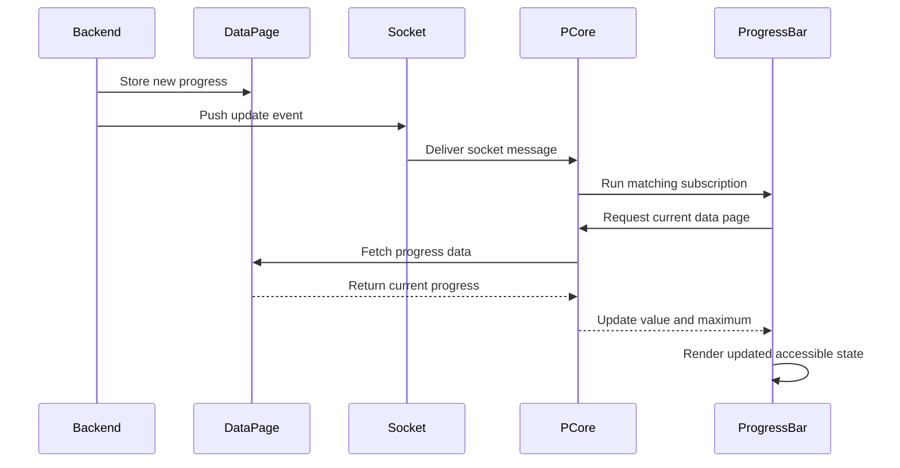

import { Meta, Primary, Controls, Story } from '@storybook/addon-docs/blocks';
import * as DemoStories from './demo.stories';

<Meta of={DemoStories} />

# Progress Bar

`Pega_Extensions_ProgressBar` is a theme-aware, accessible progress widget built for jobs that report progress from a data page. It has no bound property of its own — it reads its `value`/`max` from the configured `dataPage`, and the `updateStrategy` decides when that data page is fetched again.

| `updateStrategy`      | When the data page is fetched                                                                                                                       |
| --------------------- | --------------------------------------------------------------------------------------------------------------------------------------------------- |
| `messaging` (default) | On mount, then every time the PCore messaging service reports a matching update. Suited to jobs that push rapid updates, for example once a second. |
| `interval`            | On mount, then every `refreshIntervalSeconds` seconds (default 5, minimum 1), whether or not anything changed.                                      |
| `onLoad`              | Once on mount. The value only changes when the page is reloaded.                                                                                    |

With `messaging`, on mount the widget fetches `dataPage` via `PCore.getDataApiUtils().getData()` and subscribes to case updates with `PCore.getMessagingServiceManager().subscribe({ matcher: 'CASE', criteria: { caseId } }, ...)`. Every time the messaging service reports the case changed, the widget refetches the data page; it unsubscribes on unmount. With `interval`, the widget clears its timer on unmount and never subscribes. With `onLoad`, it neither subscribes nor polls. Until the first fetch resolves, the widget renders an indeterminate state.

The data page can also drive the visual tone: if the record includes a valid `toneProperty` value (`accent`, `success`, `warning`, or `danger`), it overrides the static `tone` prop — useful for flipping to `danger` the moment a job reports a failure.

Set `indeterminateOnly` to skip the data page and all refresh strategies entirely and just show a never-ending progress animation — useful when work is happening but there's nothing to track it against.

## Update flow

### Push (`messaging`)

The runtime messaging service owns the WebSocket connection. The progress bar subscribes to PCore and reads the latest data-page value only after the socket delivers a matching update.

For a case context, the subscription matches the `CASE` event for the current case. On a page without case context, it matches the `DATAPAGE_UPDATED` event for the configured data page.

### Polling (`interval`)

A timer fetches the data page every `refreshIntervalSeconds`. Use it when the backend cannot push updates or when a slower refresh is acceptable. The timer is cleared on unmount.

### Load once (`onLoad`)

The data page is fetched once on mount, with no timer and no messaging subscription. Use it for values that rarely change during a page session.

<Primary />

## Props

<Controls />

## Examples

<Story of={DemoStories.Complete} />

<Story of={DemoStories.AtRisk} />

<Story of={DemoStories.PollingInterval} />

<Story of={DemoStories.LoadOnce} />

<Story of={DemoStories.Continuous} />
